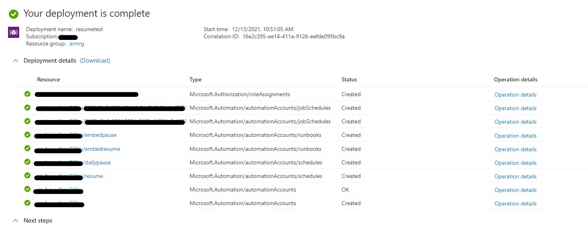
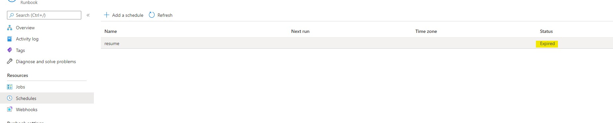
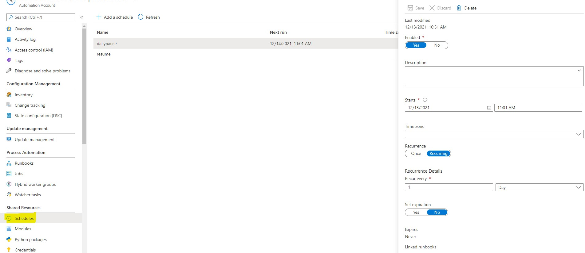
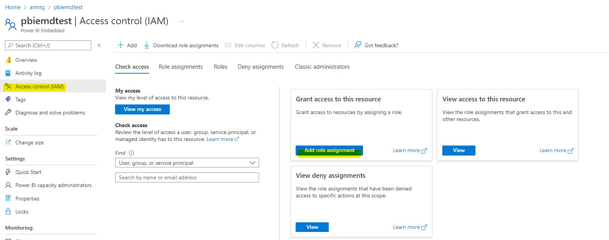

# Manage Power BI Embedded Capacity with One Click Deployment 
This 1-click deployment allows the user to deploy an automation account with runbooks and schedules that can help control the power bi embedded capacity.

# Deployment Step

Click 'Deploy To Azure' button given below to deploy all the resources.

   - Provide the values for:

     - Resource group (Same resource group where your embedded capacity sits, if you wish to deploy in a different resource group, please see [Role Assignment](https://github.com/lipinght/PBI-Embedded-Control-1-Click-Deployment/blob/main/README.md#Role-Assignment) first. )
     - automationAccountName (Default is aa- followed by a 13 character unique string determined by your resource group id)
     - embeddedCapacityName (The name of the embedded capacity that you would like to schedule control for)
     - Location (Default is your resource group location)
     - baseTime (Default is the current UTC time, by default Resume schedule will run ONCE 7 mins from this time, Pause schedule will run daily starting 10 mins from this time. You can manage schedule post deployment, please see [Managing Schedule](https://github.com/lipinght/PBI-Embedded-Control-1-Click-Deployment/blob/main/README.md#Managing-Schedule))

   - Click 'Review + Create'.
   - On successful validation, click 'Create'.

# Azure Services being deployed

Following resources and role assignments are deployed with this template.

- An Automation Account 
- Two Runbooks named embedpause and embedresume
- Two Schedules named daily pause (by default runs daily) and resume (by default runs once) 
- Two JobSchedules that links the respective runbooks and schedules together
- A role assignment that assign the MSI of automation account to the contributor role of the resource group

# Managing Schedule

You provided baseTime as part of the deployment. By default Resume schedule will run ONCE 7 mins from this time, Pause schedule will run daily starting 10 mins from this time. After the resume schedule has run once, the status will change to expired. You do not need to change it if you only wish to pause the capacity on a schedule.

If you wish to change the schedule (e.g. make resume schedule reccuring), you can manage the schedule by click on **Schedules** in **Shared Resources** in the automation account, and then click on the schedule name, change the properties, then click **Save**.

# Role Assignment 

Role Assignment is needed for automation account to have permission to manage the Power BI embedded capacity. If you do not have permission to assign roles at the resource group level or if you have selected a different resource group vs the resource group of embedded capacity during deployment step, the role assignment deployment will fail while all other resources will still deploy. 

If role assignment fails, go to **Access Control(IAM)** of the embedded capacity and click **Add Role Assignment** and select **Contributor**, click **Next**, click on **+Select Members**, type in the managed identity of the automation account deployed by template, click **Select**, click **Review+Assign**

# Multiple Embedded Capacities

You can duplicate the scripts to manage multiple embedded capacites in the same runbooks post deployment. Just remember to do the role assignment for the additional embedded capacities that you add in. 